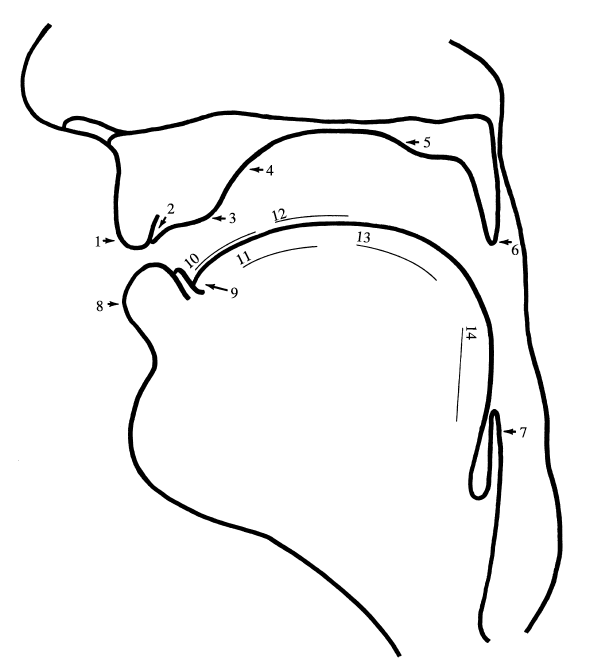

# Contributing exercises #

## A typical exercise ##

The html file for the "vocal tract tour" (https://linguistics.berkeley.edu/phonwork/vocal_tract_tour.html) shows 
a saggital view of the vocal tract with articulatory landmarks labeled by numbers (this is after exercise A 
of Chapter 1 in Ladefoged & Johnson, 2011).  The exercise then asks the student to type in the name of 
the articulatory landmark that corresponds to a number.  If the typed answer is correct another randomly selected 
number is shown, if the answer is wrong then the correct answer is shown, and then another number is selected. 
To complete this exercise, the student must get 12 correct answers, and have a run of at least 3 correct answers 
in a row.

## The html code ##

Here is the html code that goes into making this exercise:

```
    <script src="assets/js/ex/exercises.js">
    <script src="assets/js/ex/vocal_tract_tour.js">

    <body onload="initialize()">

        <h1>A tour of the vocal tract</h1>
        <p>Fill in the blanks on this figure.</p>
        
        <span class="image fit"></span>
        
        <p>Fill in the name of number: <span id="question"></span>
          <input id="answerbox" type="text" onkeydown="if (event.keyCode == 13) check_answer()" placeholder="type answer here">
          <span id="feedback"></span></p>
        <p style="font-size:small">Correct: <span id="correct">0</span> ---- Run: <span id="run">0</span></p>   
```

The key elements in the code that makes it an exercise are:
  - a list of questions and answers is loaded as *vocal_tract_tour.js*
  - when the page loads the first question is initialized.
  - an image is shown
  - there is a span with the id name of "question"
  - there is a span with the id name of "feedback"
  - there is a span with the id name of "correct"
  - there is a span with the id name of "run"
  - there is an input element with the id name "answerbox", 
  - and, the input element calls a function "check_answer() when the student presses "return"
  
## Questions and answers ##
       
The first few lines of *vocal_tract_tour.js* are here:

```
 // must assume the existence of some variables (defined in exercises.js)

exerciseName = "Vocal tract tour";
mincorrect=12;
minrun=3;

quest[0]="1"; answer[0]="upper lip|lip";
quest[1]="2"; answer[1]="upper incisors|upper front teeth|teeth";
quest[2]="3"; answer[2]="alveolar ridge";
quest[3]="4"; answer[3]="hard palate";
quest[4]="5"; answer[4]="soft palate|velum";
```

This file defines three variables that determine the overall parameters of the exercise (it's name, the number of questions that must be correctly answers, 
and the minimum number of questions that must be answered in a run of correct answers).   Then the file fills in two arrays that are used by the routines in 
experiment.js - one which contains the question that will be asked, and the other which contains answers that will be accepted as correct.  Notice that 
alternative possible answers are separated by "|".  

## That's all you need for a simple exercise - but there is much more ##

If you can write the html code like that in the preceeding paragraph and can write a javascript file 
like the one in this paragraph, you can contribute a new exercise to the workbook.  However, the phonwork framework 
can accommodate many other kinds of questions.  For instance, you can present audio, video, or an image as the question, 
you can give audio as feedback to a question, and you can just show text or play audio as examples without requiring 
an answer.  And of course, you can ask multiple choice questions instead of requiring typing.

## More about exercises.js ##

*initialize(rand=1)* 
  - checks to see if there are questions to be asked (actually looks to see if the array *answers* has any content.  
  - if *rand* equals 1 (the default) the order of the questions is randomized
  - calls *ask_question()* to put up the first question

*init_practice(rand=1)*
  - is exactly like *initialize()* except that it calls *show_practice_item()* instead of *ask_question()*
  
*ask_question()*  

  - clears the *answerbox*, *feedback*, and *example* spans if they exist in the html code of the page
  - if there is an element with the id *question* then the text in the array *quest[]* is presented.
  - if there is an element with the id *video_here* then the file named in *vidfiles[]* is presented.
  - if there is an element with the id *audio_questions* then the file named in *soundfiles[]* is presented.
  - if there is an element with the id *image_question* then the file named in *imgfiles[]* is presented.

This routine presents different kinds of questions depending on whether the html code of the page 
has tags for text, video, audio, or image questions.  An example of an audio question would have text on the screen 
like "Transcribe the first sound in this word" - and then the page would load and play an audio file.  With an element 
like `<span id=audio_questions></span>` *ask_question()* will assume that there are audio filenames in the array 
*soundfiles[]* and will play the next one in the (randomized) list.  

*show_practice_item()*
  - puts the text in *quest[]* in the span identified with the id *practice_item*
  - updates the count presented in the span identified withe the id *run*

*check_answer()*
  - if there is an element with the id *example* then fill that element with text from the array *example[]*
  - if there is an element with the id *audio_answers* then play the next soundfile in *soundfiles2[]*
  - if there is an element with the id *answerbox* check whether the typed answer is correct
  - display feedback in the *feedback* span (1.5 seconds for correct answers, 3.5 seconds for incorrect answers)
  - update and show the counts of *correct* and *run*

*check_mc_answer(id)*
  - get the value from the multiple choice item that has the id tag passed in *id*
  - display feedback and keep count of number correct as in *check_answer*

Use this function to collect multiple choice answers instead of requiring users to type text input. 

*play_audio_example()*
  - assume that there is an element *audio_example*
  - play the next sound file in the list *soundfiles2[]*

*play_video_example()*
  - assume that there is a video element *video_example* already loaded
  - this function requests that that element start playing

*finish()*
  - check whether we have completed the required number of correct responses and have a long enough run of correct responses.
  - if not call *ask_question()* again
  - if yes call *make_inline_png_cert(exerciseName)* to make a certificate of completion for this exercise.
  - if yes add completion information to this browswer's local storage area - evidence of completion

*next_practice()*
  - does the same thing for "practice" pages - where there are no correct answers
  - and also produces a certificate when enough practice items (*numrun*) have been done.

*make_png_cert(exname)*
  - creates a certificate of completion for a particular exercise in a new window in the browser
  - warn user if the browswer is preventing the page from opening a new window

*make_inline_png_cert(exname)*
  - checks *localStorage* for evidence that an exercise was previously completed
  - prints a new certificate for it


